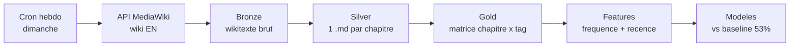

# One Piece ML — Faisabilité & état de l'art

2026-09-16 · Morotti

## Décision

**Le blocage n'existe pas : il vient du choix de la langue, pas de la nature du Fandom.** Le wiki anglais couvre les 1193 chapitres avec un résumé long complet, une liste de personnages structurée et un arc identifié — 100 % de couverture, zéro trou. Le chapitre 1190, vide côté français, y fait 6 531 octets avec un résumé de 3 742 caractères.

Trois conclusions engagent la suite du projet.

1. **Source retenue : le wiki anglais, via l'API MediaWiki** (`onepiece.fandom.com/api.php`). Le français sert au mieux de champ secondaire, pas de socle. Le japonais est écarté : la source n'existe pas.
2. **La taxonomie est déjà dans la donnée.** Le wiki anglais publie par chapitre une table de personnages groupés par faction, avec annotations d'apparition (*cover*, *flashback*). C'est exactement la variable cible visée, sans annotation manuelle.
3. **L'objectif « 80 % d'accuracy » doit être renégocié avec le client avant toute modélisation.** Sur cette tâche, un modèle qui ne prédit jamais rien atteint **98,57 % d'accuracy**. La métrique proposée est le F1 micro, où la meilleure baseline triviale plafonne à **53 %** et le plafond atteignable est **85 %**.

## Benchmark des sources

Mesures faites le 16 septembre 2026 sur les 1193 chapitres, via les API MediaWiki des trois wikis.

| Source | Chapitres couverts | Résumé long exploitable | Liste de personnages | Latence après sortie | État |
| --- | --- | --- | --- | --- | --- |
| [Wiki EN](https://onepiece.fandom.com/wiki/Chapter_1193) | 1193 / 1193 | **1193 (100 %)** | 1193 (100 %) | **\~70 min** | 226 contributeurs actifs |
| [Wiki FR](https://onepiece.fandom.com/fr/wiki/Chapitre_1193) | 1193 / 1193 | 1176 (98,6 %) | partielle | 2 à 4 jours, puis plus rien | 23 contributeurs actifs |
| [Wiki JA](https://onepiece.fandom.com/ja/) | 0 / 1193 | 0 | 0 | — | 369 articles, 1 contributeur |

**Le français n'est pas globalement mauvais, il est récemment abandonné.** Sur tout l'historique, seuls 17 chapitres sont des ébauches. Mais 9 d'entre eux sont dans les 20 derniers, et aucun chapitre depuis le 1188 (12 juillet 2026) n'a reçu de résumé. Les pages 1189 à 1193 font 1 075 à 1 593 octets : l'infobox seule. C'est précisément la zone dont le modèle a besoin pour prédire.

**La latence anglaise est le résultat le plus fort du benchmark.** Le chapitre 1193 est sorti le dimanche 13 septembre 2026 à 15 h 00 UTC. Sa page est passée de 585 à 8 013 octets entre 15 h 22 et 16 h 09 le même jour : résumé long, notes et table des personnages complets **69 minutes après la sortie**. Même schéma sur le 1192 (sorti le 6 septembre, rempli en 3 h 30). Le wiki anglais se comporte comme un flux structuré quasi temps réel, ce qui retire tout intérêt à Reddit comme source de fraîcheur.

**Le wiki japonais Fandom est un faux négatif, mais la conclusion tient quand même.** Ses 369 articles ne mesurent pas le fandom japonais : ils mesurent le désintérêt des japonais pour Fandom, qui est une plateforme anglophone. Les deux sections qui suivent détaillent d'abord pourquoi ce wiki est vide, puis ce que produit réellement le fandom japonais — et confirment qu'aucune source japonaise ne produit de résumés structurés par chapitre — et surtout qu'aucune n'est plus rapide que le wiki anglais.

### Pourquoi le wiki japonais est vide

Le chiffre de 369 articles paraît aberrant pour la première langue de l'œuvre. Il est réel, et quatre mesures l'expliquent.

| Indicateur | Wiki EN | Wiki FR | Wiki JA |
| --- | --- | --- | --- |
| Articles | 8 134 | 7 928 | **369** |
| Modifications totales | 2 128 098 | 1 464 726 | **4 932** |
| Contributeurs actifs | 226 | 23 | **1** |
| Plus ancienne révision observée | 29 nov. 2006 | 21 mai 2009 | **26 nov. 2010** |

**Ce n'est pas un wiki jeune, c'est un wiki abandonné.** Il existe depuis près de seize ans et totalise 4 932 modifications, soit 430 fois moins que la version anglaise. Les cinq dernières modifications s'étalent du 26 février au 26 août 2026 : environ une édition toutes les six semaines.

**Son contenu n'a jamais été celui d'un wiki de chapitres.** Un échantillon des articles existants donne `11月23日`, `12月25日`, `13日の金曜日`, `Mr.5`, `Mr.9`, `Dr.くれは` : des dates du calendrier et des personnages secondaires. Aucune page de chapitre n'a jamais été créée, donc il n'y a rien à récupérer même partiellement.

**Ses derniers contributeurs ne semblent pas japonais.** Sur les quatre comptes ayant édité en 2026 — `Rome soldier`, `KSantora`, `Polqka`, `ハウンジット・タイガーローグ` — un seul porte un pseudonyme japonais. Le wiki japonais de Fandom est maintenu à la marge par des utilisateurs de l'écosystème Fandom, pas par le fandom japonais.

**L'explication de fond est une question de plateforme.** Fandom est un service anglophone, et le web japonais dispose de ses propres fermes à wikis et encyclopédies collaboratives — [atwiki](https://atwiki.jp/), [Seesaa Wiki](https://wiki.seesaa.jp/ranking/), [ニコニコ大百科](https://dic.nicovideo.jp/), [ピクシブ百科事典](https://dic.pixiv.net/). Les fans japonais écrivent là, ou sur des blogs de 考察. Le chiffre de 369 mesure donc l'absence des japonais sur Fandom, pas l'absence d'activité japonaise.

**Cette correction ne change pas la conclusion, elle la déplace.** La question n'est plus « le wiki japonais est-il mort ? » mais « où le fandom japonais écrit-il, et ce qu'il écrit est-il exploitable ? ». La section suivante répond à cette question par des mesures, et la réponse reste négative — pour des raisons de format et de délai, non de volume.

## Sources japonaises et arbitrage fraîcheur

**Le décalage entre la parution japonaise et la parution anglaise officielle est nul.** *One Piece* est publié en *simulpub* : le chapitre sort dans le *Weekly Shonen Jump* japonais et sur Manga Plus en anglais **le même jour**, dimanche 15 h 00 UTC. Il n'y a donc aucune avance à récupérer d'une source japonaise officielle — l'hypothèse de départ du projet, « les scans sortent d'abord au Japon », était vraie avant l'ère Manga Plus, elle ne l'est plus.

**La seule avance réelle vient des fuites, pas de la langue.** Les raws piratés et les résumés de spoilers circulent du mercredi au vendredi, soit 2 à 5 jours avant la sortie officielle. Cette avance est accessible en anglais comme en japonais : ce n'est pas un avantage japonais, c'est un canal de fuite.

Sources japonaises testées le 16 septembre 2026, chapitre 1193 sorti le 13 septembre à 15 h 00 UTC.

| Source | Nature | Publication du 1193 | Écart à la sortie |
| --- | --- | --- | --- |
| [Wiki Fandom EN](https://onepiece.fandom.com/wiki/Chapter_1193) | Wiki structuré | 13/09, 16 h 09 UTC | **+1 h 09** |
| [onepiece-log.com](https://onepiece-log.com/blog-entry-3000.html) | Blog 感想/考察 | 07/09 05 h 30 JST *(ch. 1192)* | +5 h 30 |
| [hellominju.com](https://www.hellominju.com/2026/09/ONEPIECE1193.html) | Blog あらすじ + ネタバレ | 14/09 | +1 jour |
| [yasaoblog.fun](https://yasaoblog.fun/onepiece/netabare/1193-netabare/) | Blog ネタバレ | 12/09, maj 14/09 | −1 jour |
| [dic.pixiv.net](https://dic.pixiv.net/) | Encyclopédie | page 第1193話 inexistante | — |
| [Wiki Fandom JA](https://onepiece.fandom.com/ja/) | Wiki | inexistant | — |

**La source structurée la plus rapide au monde est le wiki anglais.** Un seul blog japonais devance la sortie officielle, d'un jour, en reprenant des fuites. Tous les autres arrivent après le wiki anglais.

**Le fandom japonais ne produit pas de wikis, il produit des 考察ブログ.** C'est une différence culturelle, pas un manque d'activité : onepiece-log.com couvre chaque chapitre depuis 2015. Mais ce sont des billets d'analyse et d'impressions, sans résumé canonique ni liste de personnages. Leurs URL ne sont pas dérivables du numéro de chapitre — `blog-entry-3000.html` pour le 1192, `onepiece991` en 2021 contre `ONEPIECE1178` en 2026, `/netabare/1193-netabare/` contre `/weekly-jump/chapter-1192-we-wont-allow-it/` — ce qui rend l'ingestion fragile et impose un index maintenu à la main.

**L'avance n'a de toute façon aucune valeur pour ce projet.** Le modèle prédit le chapitre n+1 à partir des chapitres jusqu'à n. Connaître les tags de n deux jours plus tôt ne change rien à la prédiction de n+1, qui sort sept jours après : cela avance seulement le moment où l'on peut *noter* une prédiction déjà faite. L'arbitrage se pose donc ainsi : échanger 100 % de couverture structurée, une table de personnages et un label d'arc contre, au mieux, deux jours d'avance sur une vérification.

**Réponse à la question posée : non, le sacrifice n'en vaut pas la peine.** Il faut ajouter que les sources qui procurent cette avance rediffusent des scans piratés, ce qui est difficile à assumer dans un livrable académique, alors que le contenu Fandom est sous licence CC BY-SA et citable.

Si le client tient à exploiter le signal précoce, la voie propre existe et reste marginale : un indicateur optionnel dérivé des spoilers, utilisé **uniquement à l'inférence et jamais à l'entraînement**, pour ne pas contaminer le corpus. À traiter au plus tôt en semaine 7, et seulement si les semaines 5 et 6 ont déjà tranché la conjecture.

## La taxonomie existe déjà dans la source

Chaque page de chapitre du wiki anglais suit un gabarit fixe, en wikitexte, directement parsable. Le chapitre 1193 en donne la forme canonique.

| Champ | Disponibilité | Ce qu'il apporte à la taxonomie |
| --- | --- | --- |
| `{{Chapter Box}}` | 1193 / 1193 | Titre FR/EN/JP, romanisation |
| `==Long Summary==` | **1193 / 1193** | 3 664 caractères en moyenne, texte libre à taguer |
| `==Short Summary==` | 1151 / 1193 (96,5 %) | Résumé court, dense en entités |
| `==Characters==` | **1193 / 1193** | 22,7 personnages par chapitre en moyenne, groupés par faction |
| `==Chapter Notes==` | 1193 / 1193 | 30,6 puces d'événements factuels par chapitre |
| `{{<Nom> Arc}}` | **1193 / 1193** | 33 arcs, label d'arc exploitable directement |

La section `Characters` est une table `CharTable` groupée par faction — Straw Hat Pirates, World Government, Knights of God — avec des annotations d'apparition entre apostrophes : `''(cover)''`, `''(flashback)''`. Cette distinction répond directement à la question « présent à l'image ou non », sans annotation manuelle.

**L'univers de labels est à la fois riche et exploitable.** Sur 1 593 personnages distincts, 101 apparaissent dans au moins 50 chapitres, 333 dans au moins 20, 538 dans au moins 10. Une taxonomie v1 de 100 à 300 labels personnage a donc assez d'exemples pour être apprise, sans décider arbitrairement d'un périmètre : le seuil de fréquence le fixe.

Les `Chapter Notes` sont la réserve pour une taxonomie v2 d'événements. Ce sont des phrases courtes et factuelles (« Zoro breaks free from Sommers' thorns and stabs Sommers' heart »), plus faciles à convertir en tags d'événement que la prose du résumé long. À traiter après la v1, pas en même temps.

## L'objectif de 80 % d'accuracy est un piège

**Un modèle qui répond « aucun personnage » à chaque chapitre obtient 98,57 % d'accuracy.** Le calcul est mécanique : l'univers compte 1 593 labels, un chapitre en active 22,7 en moyenne, donc 98,57 % des cases de la matrice sont des zéros qu'un modèle vide devine correctement.

Si le critère de recette reste « 80 % d'accuracy », le projet est validé par un modèle qui ne sert à rien, et la conjecture n'est ni prouvée ni réfutée. C'est un point à remonter au client dès la semaine 1, pas à la livraison.

La métrique à proposer à la place :

- **F1 micro sur l'ensemble des labels prédits** comme métrique principale. Elle ne crédite que les présences correctement prédites et pénalise les faux positifs.
- **Precision@k** avec k ≈ 20, proche de la taille réelle d'un casting de chapitre. Plus lisible pour le client : « sur les 20 personnages annoncés, combien apparaissent vraiment ».
- **Comparaison systématique à la baseline de persistance** (section suivante). Un modèle qui ne la bat pas ne démontre rien, quel que soit son score absolu.
- **F1 séparé sur les labels « déjà vus récemment » et « nouveaux »**, la décomposition *repeat / explore* de la littérature next-basket. C'est là que se joue la valeur ajoutée réelle.

**Le découpage train/test doit être temporel, jamais aléatoire.** Un split aléatoire met des chapitres du même arc des deux côtés et fuite massivement : le modèle apprend le casting de l'arc, pas sa dynamique. Le protocole correct est un split chronologique, par exemple entraînement sur les chapitres 1 à 1000, validation sur 1001 à 1100, test sur 1101 à 1193, ou une validation glissante en avant.

## Les baselines : la barre réelle à battre

Baselines calculées sur les transitions des chapitres 100 à 1193, cible = l'ensemble des personnages du chapitre n+1. Aucun apprentissage, uniquement des règles.

| Baseline | Précision | Rappel | **F1 micro** |
| --- | --- | --- | --- |
| Tout à zéro (mesuré en accuracy) | — | 0 % | 0 % *(98,57 % d'accuracy)* |
| Persistance : casting de n | 53,0 % | 52,9 % | **53,0 %** |
| Fréquence pondérée, 10 chapitres, top 25 | 51,8 % | 54,5 % | **53,1 %** |
| Union de n et n−1 | 43,8 % | 64,4 % | 52,2 % |
| Union de n, n−1, n−2 | 38,5 % | 70,2 % | 49,7 % |
| Intersection de n et n−1 | 68,2 % | 36,1 % | 47,2 % |
| Union des 5 derniers | 31,9 % | 76,1 % | 45,0 % |

**La barre est à 53 % de F1 micro.** Elle est remarquablement plate : élargir la fenêtre gagne du rappel et perd autant de précision. Aucune règle simple ne dépasse ce plateau, ce qui est une bonne nouvelle — le problème n'est pas trivial, mais il est stable et il y a un étalon clair.

**Le plafond est à 85,1 %.** C'est la part des personnages du chapitre n+1 qui sont apparus au moins une fois dans les 20 chapitres précédents. Les 14,9 % restants sont des personnages jamais vus récemment : structurellement imprévisibles à partir des seules séquences de tags. **La zone de travail utile du ML est donc 53 % → 85 %**, et c'est ce qu'il faut annoncer au client plutôt qu'un objectif de 80 % d'accuracy.

**Le changement d'arc fait mal, mais il est rare.** Votre intuition est confirmée et chiffrée : la persistance tombe de 54,2 % de F1 à l'intérieur d'un arc à 37,5 % lors d'un changement d'arc, soit 17 points. Mais ces transitions ne représentent que 32 des 1 192 passages, soit 2,7 %. Elles ne condamnent pas le projet ; elles justifient une variable explicative « position dans l'arc » et une évaluation reportée séparément sur ces 32 cas.

Certaines transitions sont à 0 % de rappel — les chapitres 467, 592, 903, 1037, 1079, 1086 — typiquement un saut vers un flashback ou une bascule complète de lieu. Ce sont des cas irréductibles à documenter, pas à corriger.

## État de l'art

**Le problème n'est pas de la classification de texte, c'est de la prédiction d'ensemble suivant.** Nommé correctement, il appartient à la famille *next-basket recommendation* : on observe une séquence de paniers (ici, les castings des chapitres 1 à n) et on prédit le panier n+1. Ce cadrage change la bibliographie, les baselines et les métriques — et c'est l'apport principal de l'état de l'art pour ce projet.

Trois références structurent le travail.

- [**A Next Basket Recommendation Reality Check**](https://arxiv.org/pdf/2109.14233) (Li et al., TOIS 2023). Le résultat central : sur la plupart des jeux de données, des baselines de fréquence et de répétition égalent ou battent les modèles profonds, et beaucoup de gains publiés disparaîtraient face à ces baselines. L'article introduit la décomposition *repeat / explore* qui sert de métrique secondaire ici. C'est la justification méthodologique de mesurer la persistance avant tout modèle.
- [**Modeling Personalized Item Frequency for Next-basket Recommendation**](https://arxiv.org/pdf/2006.00556) (Hu et al., SIGIR 2020). Le modèle TIFU-KNN : fréquence des items pondérée par décroissance temporelle, plus un k-NN. Peu coûteux, compétitif face aux RNN, et directement transposable ici — la baseline à 53,1 % de la section précédente en est une version simplifiée.
- [**Review of Extreme Multi-label Classification**](https://arxiv.org/html/2302.05971v3) (Dahiya et al.). Pour le versant évaluation : avec 1 593 labels et une distribution en longue traîne, l'accuracy est inutilisable et les métriques de référence sont precision@k et les variantes propens*ity-scored*. Sert à argumenter le changement de métrique auprès du client.

**Ce qui n'existe pas dans la littérature :** aucun travail publié ne prédit les tags d'un chapitre de manga à partir des chapitres précédents. C'est l'originalité du sujet, et c'est aussi pourquoi la conjecture mérite d'être testée plutôt que supposée. Les travaux voisins portent sur la prédiction de personnages dans les séries télévisées et sur la modélisation d'arcs narratifs, mais sans cible multi-label séquentielle.

**Familles de modèles à tester, par coût croissant.**

1. Régression logistique ou gradient boosting *un modèle par label*, sur des variables de fréquence et de récence. Interprétable, rapide, et suffisant pour trancher la conjecture.
2. Factorisation ou k-NN sur la matrice chapitre × personnage, dans l'esprit de TIFU-KNN.
3. Encodage du texte du résumé de n (TF-IDF, ou embeddings d'un modèle libre type Sentence-Transformers) ajouté aux variables de séquence. C'est ici que le corpus texte apporte du sens au-delà de la simple persistance.
4. Modèle séquentiel (GRU ou petit Transformer) seulement si les trois premiers dépassent la baseline. Avec 1193 exemples, le risque de surapprentissage est élevé.

## Pipeline et cadre d'outils

**Bronze** — le wikitexte brut de chaque chapitre, tel que rendu par `action=query&prop=revisions&rvprop=content`, plus la date de révision. On ne transforme rien : c'est la copie d'archive qui évite de re-scraper à chaque changement de schéma. 50 titres par requête, soit 24 appels pour tout l'historique.

**Silver** — un fichier `.md` par chapitre, avec front-matter YAML : numéro, titre, arc, date de révision, liste de personnages avec faction et type d'apparition, puis le résumé long en corps de texte. C'est le format que vous aviez prévu, alimenté par un parseur déterministe du wikitexte plutôt que par du scraping HTML.

**Gold** — la matrice binaire chapitre × label, filtrée par seuil de fréquence, plus les variables dérivées. C'est l'entrée du ML.

| Besoin | Outil | Coût |
| --- | --- | --- |
| Ingestion | `requests` sur l'API MediaWiki | 0 € |
| Parsing wikitexte | `mwparserfromhell` ou regex | 0 € |
| Stockage | Fichiers `.md` + Parquet, versionnés en Git | 0 € |
| Modélisation | `scikit-learn`, `lightgbm` | 0 € |
| Texte | `sentence-transformers` en local | 0 € |
| Ordonnancement | GitHub Actions, dimanche 18 h UTC | 0 € |
| Suivi d'expériences | MLflow local ou un simple CSV de runs | 0 € |

**Aucun budget n'est nécessaire.** L'API MediaWiki est publique et sans clé ; le contenu Fandom est sous licence CC BY-SA, ce qui autorise l'usage académique avec attribution — à mentionner dans le rapport final. Un `User-Agent` identifiant le projet et une limite de débit raisonnable suffisent à rester dans les clous.

**Le cron hebdomadaire se déclenche le dimanche soir**, après la sortie de 15 h UTC et le remplissage du wiki en une à trois heures. Le job compare `lastrevid` de chaque page à la valeur stockée, ne retraite que ce qui a bougé, et crée la nouvelle page si elle apparaît. Un chapitre dont le résumé long fait moins de 300 caractères est marqué `incomplet` et repassé la semaine suivante, ce qui rend le pipeline robuste aux semaines de pause d'Oda.

## Plan sur 8 semaines

Huit semaines de projet séparées chacune par deux semaines de cours. L'espacement impose de terminer chaque semaine sur un artefact exécutable et documenté, pas sur un travail en cours.

| Semaine | Livrable | Critère de fin |
| --- | --- | --- |
| 1 | Faisabilité + état de l'art (ce document) | Source tranchée, métrique renégociée avec le client |
| 2 | Bronze complet | 1193 chapitres archivés, script rejouable |
| 3 | Silver + taxonomie v1 | 1193 `.md` avec front-matter, univers de labels figé par seuil |
| 4 | Gold + baselines reproduites | Matrice + F1 de 53 % reproduit par votre code |
| 5 | Modèles 1 et 2 | Premier résultat comparé à la baseline, split temporel |
| 6 | Variables texte | Apport mesuré des embeddings de résumé |
| 7 | Pipeline hebdomadaire | Cron qui tourne seul, mise à jour incrémentale vérifiée |
| 8 | Rapport + soutenance | Conjecture tranchée, chiffres à l'appui |

**Le résultat de la semaine 5 est le point de décision du projet.** S'il dépasse nettement 53 % de F1, la conjecture tient et les semaines 6 à 8 l'approfondissent. S'il reste collé à la baseline, le projet reste valide : il conclut que la taxonomie seule ne porte pas de signal prédictif au-delà de la persistance, ce qui est un résultat publiable à condition d'avoir le protocole propre.

**Un résultat négatif bien mesuré vaut mieux qu'un résultat positif mal mesuré.** C'est à cadrer avec le client dès maintenant, pour que la semaine 8 ne se joue pas sur un score absolu.

**Cette semaine, après ce document**, si le temps le permet : lancer le bronze. Le script d'ingestion est court et les 24 requêtes prennent moins d'une minute — prendre de l'avance sur la semaine 2 est réaliste.

## Risques

| Risque | Gravité | Mitigation |
| --- | --- | --- |
| Le client maintient l'objectif de 80 % d'accuracy | Élevée | Le porter en semaine 1 avec le chiffre de 98,57 % ; proposer F1 micro et precision@20 |
| Le modèle ne bat pas la baseline de 53 % | Moyenne | Prévu : reformuler le livrable en réfutation argumentée de la conjecture |
| Fuite de données par split aléatoire | Élevée | Split chronologique imposé dès la semaine 4, vérifié par un test |
| Le wiki EN change de gabarit | Faible | Bronze archivé : reparser sans re-scraper |
| Pause d'Oda pendant le projet | Faible | Trois chapitres sur quatre semaines ; le cron marque `incomplet` et repasse |
| Seuls 1193 exemples pour 1 593 labels | Moyenne | Seuil de fréquence sur les labels, modèles simples avant les modèles profonds |
| Sur-intégration du texte avant d'avoir la baseline | Moyenne | Ordre imposé : baseline d'abord, texte en semaine 6 |

**Le risque numéro un n'est pas technique.** La donnée est là, propre et complète ; le pipeline est simple. Ce qui peut faire échouer le projet, c'est un critère de recette qui rend le résultat ininterprétable. Cette conversation avec le client est le vrai livrable de la semaine 1.

### Sources

- [API MediaWiki du wiki One Piece anglais](https://onepiece.fandom.com/api.php) — couverture, latences et matrice de personnages, relevées le 16 septembre 2026
- [API MediaWiki du wiki One Piece français](https://onepiece.fandom.com/fr/api.php)
- [Wiki One Piece japonais](https://onepiece.fandom.com/ja/) — 369 articles, sans page de chapitre
- [Calendrier de parution One Piece, Popverse](https://www.thepopverse.com/comics-one-piece-manga-release-date-upcoming-chapters-new-shonen-jump-viz-time-next-issue) — dates de sortie des chapitres 1192 à 1194
- [One Piece Manga Release Schedule Explained, AnimeNagi](https://animenagi.com/one-piece-manga-release-schedule-explained-how-chapters-are-released/) — simulpub japonais/anglais, fenêtre de fuite mercredi–jeudi
- [When will One Piece Chapter 1191 spoilers arrive, Business Upturn](https://businessupturn.com/entertainment/when-will-one-piece-chapter-1191-spoilers-arrive-expected-leak-timeline-explained-2/) — chronologie détaillée des fuites
- [ワンピース.Log](https://onepiece-log.com/blog-entry-3000.html) — blog japonais, couverture depuis 2015, billet du chapitre 1192
- [hellominju.com, chapitre 1193](https://www.hellominju.com/2026/09/ONEPIECE1193.html) — blog japonais あらすじ + ネタバレ
- [yasaoblog.fun, chapitre 1193](https://yasaoblog.fun/onepiece/netabare/1193-netabare/) — blog japonais de spoilers
- [A Next Basket Recommendation Reality Check](https://arxiv.org/pdf/2109.14233)
- [Modeling Personalized Item Frequency Information for Next-basket Recommendation](https://arxiv.org/pdf/2006.00556)
- [Review of Extreme Multi-label Classification](https://arxiv.org/html/2302.05971v3)
